# T1A2 Portfolio Documentation
---
## [Portfolio Website](https://stately-choux-1f659b.netlify.app)

## [Github Repo](https://github.com/JakobCoding/PortfolioAssignment.git)
---
## Purpose and Target Audience 
As an aspiring web developer the purpose for undertaking this task was to create a website that displays my skills, background and current projects that I am working on. I decided the best way to do this was to produce a website that is professional, stylish, modern, interactive and easy to navigate. I wanted to produce a site that would engage potential employers while also making it very easy to contact me via social media links and a call to action contact form at the bottom of each page, a direct link to my CV was also attached. My email and contact number information was displayed clearly and I made sure to attach the international call code just in case prospective employers not only from Australia but also other parts of the world were able to contact me. I structured the website this way to showcase what a real business website could potentially look like and the elements that can be utilized in order to promote and advertise an employer’s company or business. Target audience is prospective employers in the IT field, local businesses, startup firms and ecommerce entrepreneurs who could use the services of a web developer.   
## Functionality / Features
This website is accessible and fully responsive to all modern media screens including mobile phones, tablets and desktops. Due to some complexities of the site the code was designed with readability in mind and I feel it is fully symantic. The website contains a range of colors set out in a common theme that continues throughout the site, Animations and effects to showcase my abilities and engage the user while still maintaining an ease of use and minimalistic theme. The site contains a scroll style landing page with 5 pages in total to navigate through:
## Pages
- Home/Landing Page: The most comprehesive page on the site it combines all the sites pages (except for the blog page) in one scroll style presentation for ease of access to the content I feel is most important eg: My skills, experience, background, education, social media links, portrait, contact information and some cool effects to bring it all together. 
- About Page: Displays a portrait and brief paragraph about myself and future aspirations, while also aranging my background, education, skills and personal information into a drop down tab style layout. 
- Serviecs page: Displays what professional services I can provide as well as keeping with the theme of the website I have displayed the information with some HTML5 and CSS animations and effects.
- Portfolio Page: Contains my work, current and past projects displayed with external links and styled with the common theme of the website in mind.
- Blog Page: Includes 5 blog posts that are important to me and displayed in the common them of the website.
- Contact Page: Last but not least the contact page contains all my social media links, a downloadable CV link and a contact me flex box form that allows the user to contact with a message of their choice while also collecting their contact information which could be utilized to create an email list. For the purpose of this website I have included this feature to allow easy and efficient initial contact between myself and a potential employer who might not have the time to send me an email on the spot phone call.
---
# Sitemap 
Created using WireframeCC.

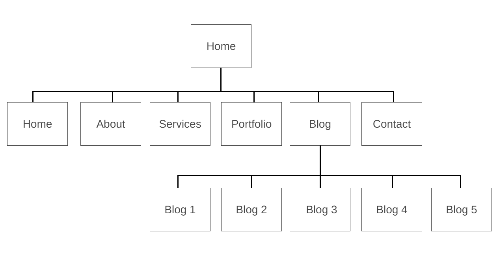 

# Screenshots

## Home Page:
Desktop view

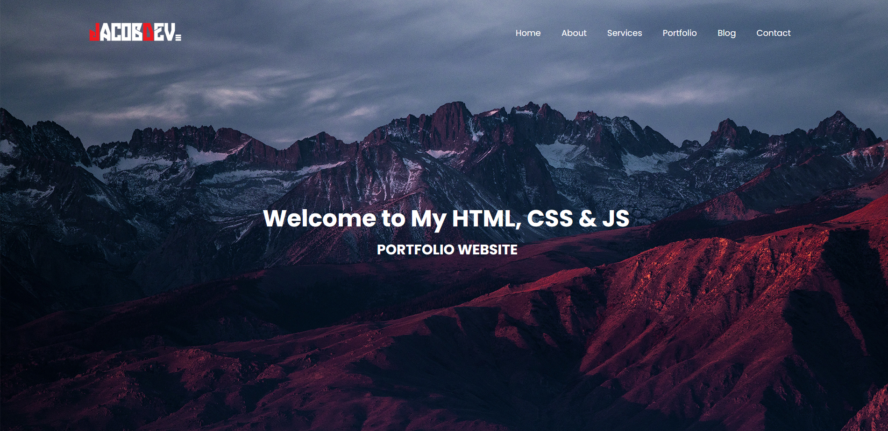

Tablet view

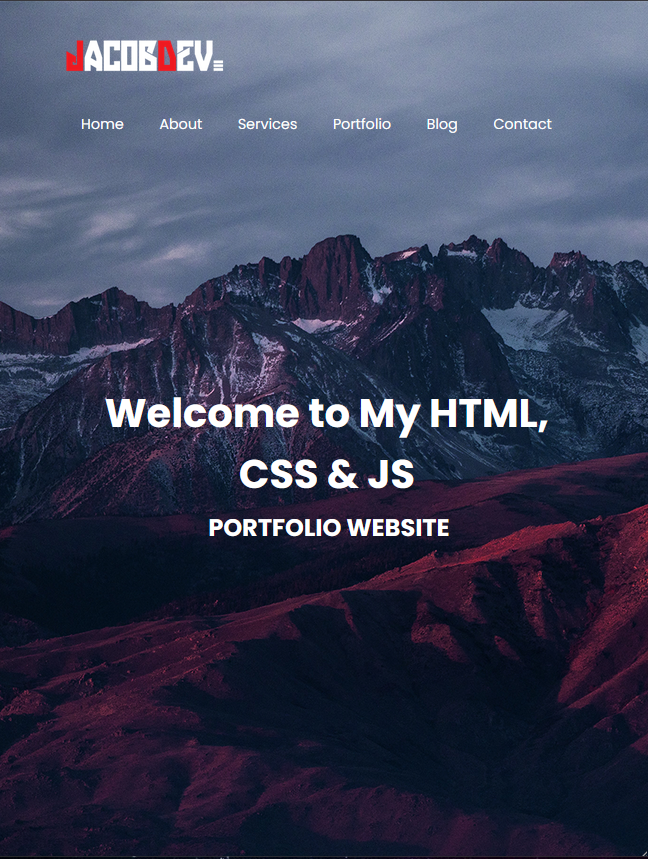

Mobile view

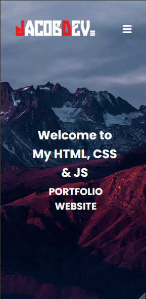

## About Page:
Desktop view

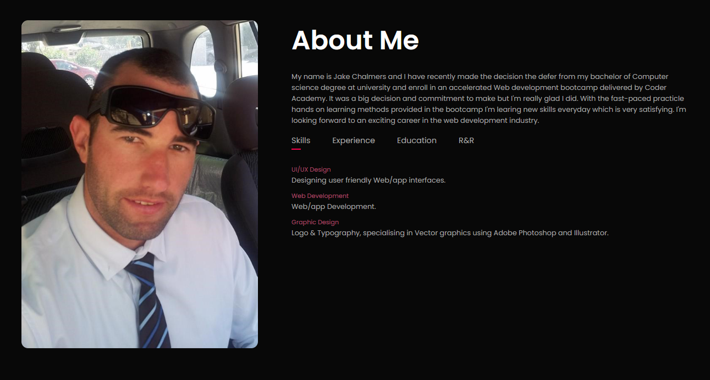

Tablet view

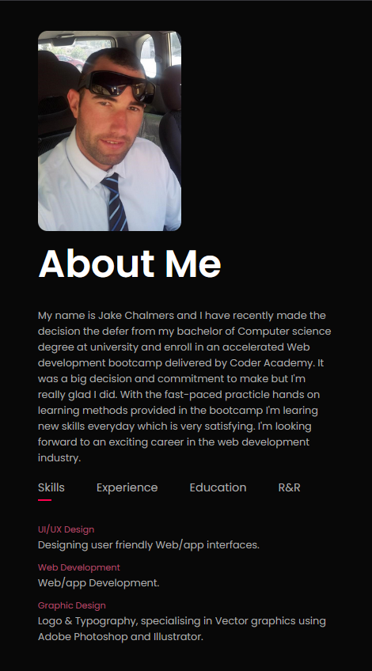

Mobile view

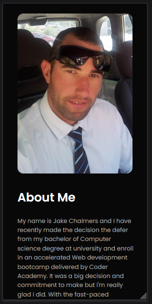

## Services Page:
Desktop view

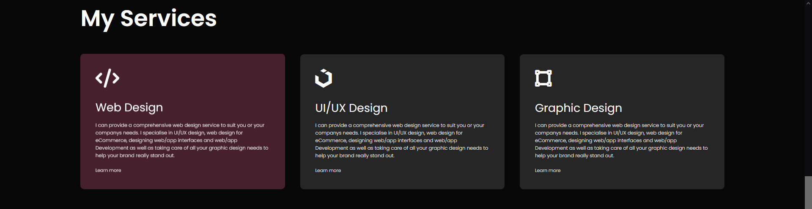

Tablet view

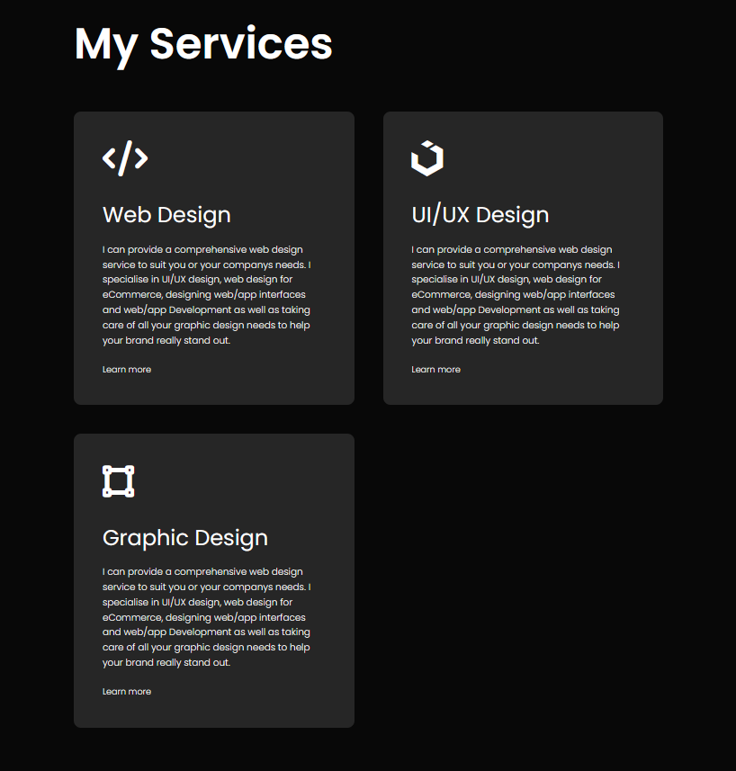

Mobile view

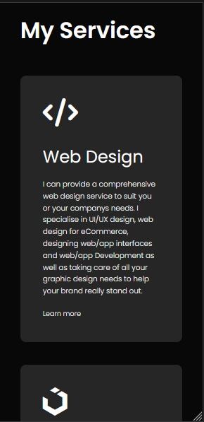

## Portfolio Page:
Desktop view

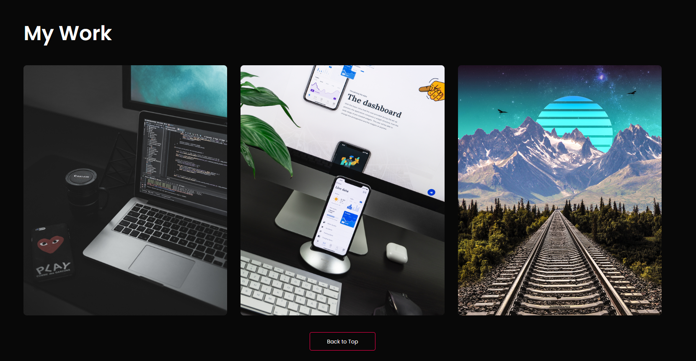

Tablet view

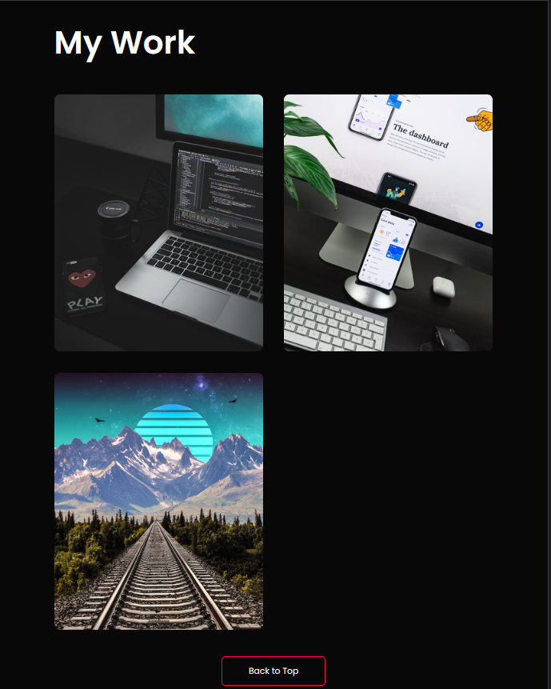

Mobile view

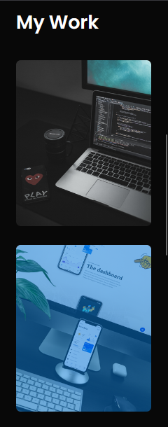

## Blog Page:
Desktop view

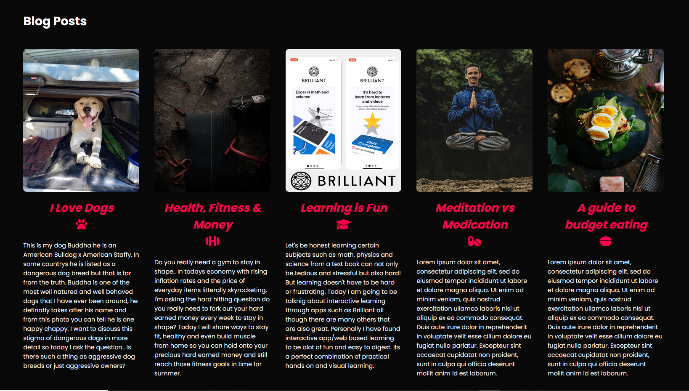

Tablet view

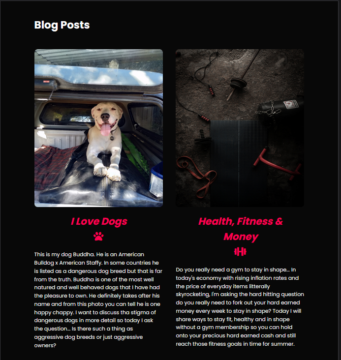

Mobile view

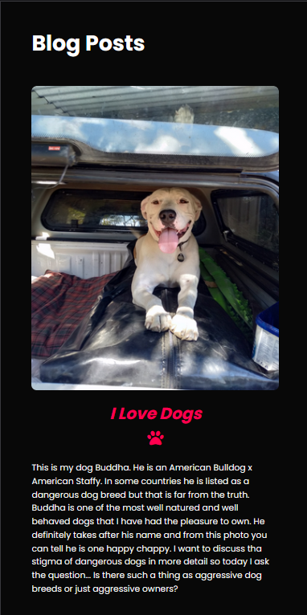

## Contact Page:
Desktop view

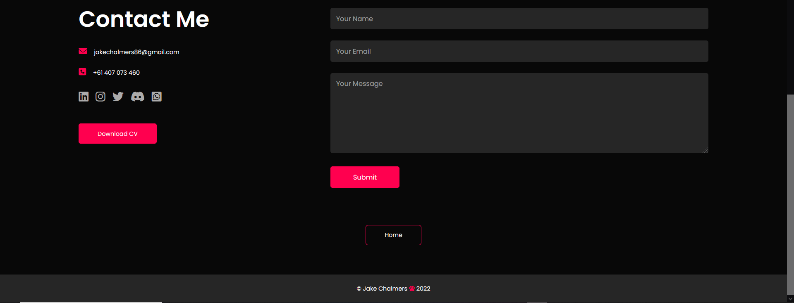

Tablet view

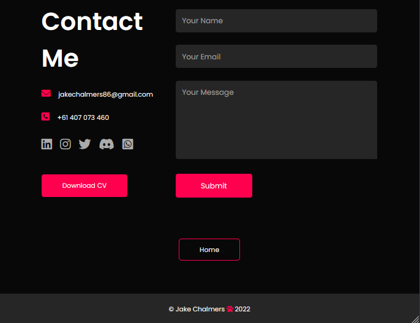

Mobile view

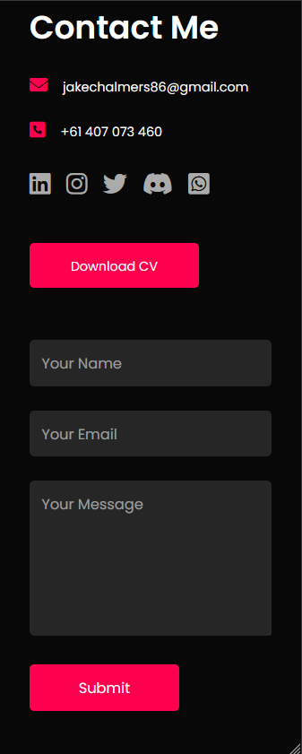

---

## Tech Stack

- Image Editing & Resizing: Adobe Photo Shop , Adopbe Illustrator 
- Website: HTML5, CSS & Javascript
- Wireframes/sitemap: WireframeCC
- Code Editor: VS Code
- Portfolio Host: Git hub
- Site Deployment: Git hub & Netlify 

